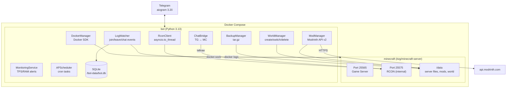
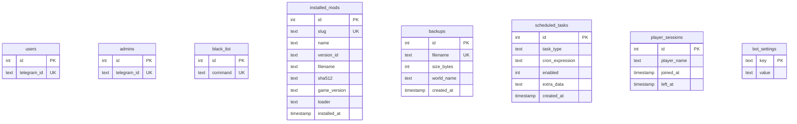
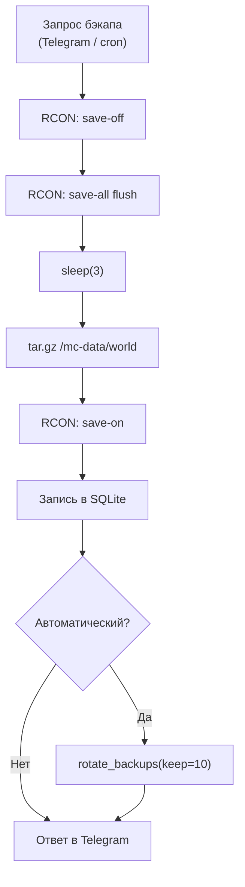

# Minecraft Server

Minecraft сервер с полным управлением через Telegram-бота. Docker Compose разворачивает два контейнера: игровой сервер ([itzg/minecraft-server](https://github.com/itzg/docker-minecraft-server)) и Python-бот с RCON-подключением, Docker API, Modrinth интеграцией и автоматизацией.

## Возможности

### Управление сервером
- Запуск / остановка / перезапуск через Telegram (Docker API)
- Просмотр логов сервера (50/200 строк)
- Мониторинг CPU, RAM, TPS в реальном времени
- Автоматические алерты при проблемах (TPS < 15, RAM > 90%)
- Пароль сервера: установка, просмотр, удаление через бота

### Управление игроками
- Список онлайн игроков
- Kick / Ban / Pardon
- Whitelist управление
- OP / Deop
- Gamemode / Teleport
- Broadcast сообщения

### Моды (Modrinth)
- Поиск модов с автофильтрацией по текущей версии и лоадеру
- Результаты поиска с описанием, загрузками и категориями
- Детальный просмотр: лицензия, дата обновления, ссылка на Modrinth
- Установка с верификацией SHA512
- Список установленных модов
- Удаление модов
- Проверка обновлений
- Навигация «назад» сохраняет позицию в результатах поиска

### Бэкапы
- Ручное и автоматическое создание бэкапов
- Безопасная процедура: `save-off` → `save-all flush` → `sleep(3)` → `tar.gz` → `save-on`
- Список с размерами и датами
- Скачивание через Telegram (до 50 МБ)
- Восстановление из бэкапа
- Ротация старых бэкапов

### Миры
- Список миров с размерами и датами
- Создание нового мира (пустая директория → генерация при запуске)
- Переключение активного мира (меняет `level-name` в `server.properties`)
- Переименование миров (с автообновлением `server.properties`)
- Удаление неактивных миров с подтверждением
- Бэкап конкретного мира из меню миров

### Конфигурация
- Просмотр и редактирование `server.properties` через бота
- Категории свойств: Производительность, Геймплей, Мир, Сеть
- Кнопочный выбор значений для каждого типа свойства:
  - **bool** → ВКЛ / ВЫКЛ
  - **enum** → кнопки с вариантами (difficulty, gamemode)
  - **range** → пресеты + ручной ввод (view-distance, max-players)
  - **text** → FSM-ввод (motd, level-name, seed)
- Информация о сервере: версия MC, тип, RAM (read-only из Docker)

### RCON-консоль и пресеты
- Быстрые пресеты по категориям: Время, Погода, Режим игры, Телепорт, Выдача, Сервер
- Команды без параметров выполняются мгновенно по нажатию кнопки
- Команды с параметрами (игрок, координаты) — FSM-ввод с подсказками
- Ручной ввод произвольной RCON-команды
- Навигация «назад к категории» после выполнения команды

### Планировщик
- Визуальный конструктор расписания: интервал (1-12ч), ежедневно, еженедельно — по кнопкам
- Ручной cron-ввод для опытных пользователей
- Автоматические бэкапы по расписанию
- Авто-рестарт с предупреждением игроков (за 1 мин и 10 сек)
- Запланированные RCON команды
- Включение/отключение задач без удаления

### Уведомления и чат-бридж
- Уведомления о входе/выходе игроков в Telegram группу
- Чат-бридж MC → Telegram: сообщения из игры пересылаются в группу
- Чат-бридж Telegram → MC: сообщения из группы отправляются в игру через `tellraw`
- LogWatcher — фоновый сервис, парсит логи контейнера каждые N секунд
- Настраиваются из бота (🤖 Настройки бота): вкл/выкл уведомлений, чат-бриджа, ID чата

### Настройки бота
- Тогглы уведомлений и чат-бриджа прямо из Telegram (действуют мгновенно)
- Указание ID чата для отправки (через ввод или пересылку сообщения)
- Настройки хранятся в SQLite (`bot_settings`), не требуют env-переменных и рестарта

### Статистика игроков
- Автоматический трекинг сессий (join/leave)
- Общее время на сервере, количество сессий, last seen
- Кнопка «📊 Статистика» в меню игроков
- Топ-15 игроков по playtime с онлайн-индикатором

### Уведомления об ошибках
- Необработанные ошибки бота отправляются супер-админу в Telegram
- Сообщение содержит: тип ошибки, traceback, информацию о пользователе и callback
- Rate limiting: не чаще 1 ошибки в 60 секунд

### Администрирование
- Многоуровневый доступ: гость → пользователь → админ
- Управление ролями через бота
- Blacklist RCON команд

## UX: навигация и визуал

- **Single-message навигация**: бот редактирует одно сообщение вместо создания новых. Чат не засоряется
- **Inline-only меню**: вся навигация через inline-кнопки. Reply keyboard сведена к минимуму — только `📋 Меню` как fallback
- **Секции с заголовками**: каждый раздел имеет описание, заголовок с разделителями `━━━━`
- **Прогресс-бары**: CPU и RAM отображаются как `▓▓▓░░░░░░░` с цветовыми индикаторами 🟢🟡🔴
- **Ролевые меню**: `/start` показывает кнопки доступные по роли (админ видит 10 разделов, юзер — 3, гость — 1)
- **FSM-ввод**: новые сообщения появляются только когда нужен текстовый ввод (ник, команда, время)
- **Catch-all**: любое нераспознанное сообщение возвращает главное меню — панель управления не теряется
- **Кнопка перезапуска**: после установки/удаления модов, восстановления бэкапа, изменения конфига
- **Валидация ников**: RCON-команды проверяют формат имени игрока перед отправкой

## Архитектура



### Потоки данных

| Компонент | Протокол | Назначение |
|---|---|---|
| RconClient → minecraft | RCON (TCP 25575) | Команды серверу, TPS, список игроков |
| DockerManager → Docker | Unix socket | Start/stop/restart/logs/stats контейнера |
| ModManager → Modrinth | HTTPS REST API v2 | Поиск, скачивание, проверка обновлений модов |
| BackupManager → /mc-data | Filesystem | Чтение мира для tar.gz архивации |
| WorldManager → /mc-data | Filesystem | Создание, удаление, переименование миров |
| MonitoringService | RCON + Docker API | Периодическая проверка TPS и RAM |
| LogWatcher → Docker | Docker logs API | Парсинг join/leave/chat событий |
| ChatBridge → minecraft | RCON tellraw | Пересылка сообщений Telegram → MC |
| Scheduler | APScheduler cron | Автоматические бэкапы, рестарты, команды |

## Структура проекта

```
minecraft-server/
├── docker-compose.yml          # MC сервер + бот
├── .env.example                # Шаблон переменных окружения
├── .gitignore
├── Makefile                    # Shortcuts: up, down, build, logs...
├── LICENSE
│
├── scripts/
│   ├── setup.sh                # Первоначальная настройка (.env + директории)
│   └── restore.sh              # CLI восстановление из бэкапа
│
├── server/
│   └── data/                   # MC server files (gitignored)
│
├── backups/                    # Backup storage (gitignored)
│
└── bot/
    ├── Dockerfile              # python:3.13-slim + gcc
    ├── requirements.txt        # aiogram, aiosqlite, docker, aiohttp...
    ├── bot.py                  # Entry point: startup/shutdown hooks, router registration
    │
    ├── core/
    │   ├── config.py           # Frozen dataclass Config из env vars
    │   └── loader.py           # Bot + Dispatcher + MemoryStorage
    │
    ├── db/
    │   └── database.py         # SQLite: users, admins, black_list,
    │                           #   installed_mods, backups, scheduled_tasks,
    │                           #   player_sessions
    │
    ├── minecraft/
    │   ├── rcon.py             # Async RCON через asyncio.to_thread(MCRcon)
    │   ├── rcon_presets.py     # Категории пресетных RCON-команд (время, погода, TP...)
    │   ├── docker_manager.py   # Docker SDK: start/stop/restart/status/logs
    │   ├── player_manager.py   # RCON обёртки: kick/ban/whitelist/op/gamemode/tp
    │   ├── backup_manager.py   # Создание/восстановление/ротация tar.gz бэкапов
    │   ├── mod_manager.py      # Установка/удаление модов + SHA512 верификация
    │   ├── server_config.py    # Чтение/запись server.properties + кнопочные типы свойств
    │   └── world_manager.py    # Создание/переключение/удаление/переименование миров
    │
    ├── services/
    │   ├── modrinth.py         # Modrinth API v2 клиент (aiohttp)
    │   ├── monitoring.py       # Фоновый мониторинг TPS/RAM + Telegram алерты
    │   ├── log_watcher.py      # Парсинг логов MC: join/leave/chat события
    │   └── scheduler.py        # APScheduler: cron задачи из БД
    │
    ├── routers/
    │   ├── common.py           # /start, /id, nav:main — inline главное меню
    │   ├── admin.py            # Роли, blacklist команд (inline KB + FSM)
    │   ├── bot_settings.py     # Тогглы уведомлений/бриджа, ID чата (inline KB + FSM)
    │   ├── console.py          # RCON консоль: пресеты + ручной ввод (FSM)
    │   ├── server.py           # Управление сервером + пароль (inline KB + FSM)
    │   ├── players.py          # Игроки + статистика (inline KB + FSM)
    │   ├── mods.py             # Моды: поиск/установка/удаление (inline KB + пагинация)
    │   ├── backups.py          # Бэкапы: создание/список/скачивание/восстановление
    │   ├── config_editor.py    # server.properties: категории, кнопочный выбор значений
    │   ├── monitoring.py       # Мониторинг с прогресс-барами + кнопка обновить
    │   ├── scheduler.py        # Управление cron-задачами
    │   ├── worlds.py           # Управление мирами: список, создание, переключение, удаление
    │   └── chat_bridge.py      # Чат-бридж Telegram → MC (tellraw)
    │
    ├── states/
    │   └── states.py           # FSM StatesGroups (11 групп, вкл. WorldState, RconState, SchedulerState)
    │
    ├── filters/
    │   └── text_filter.py      # TextInFilter + IsAdminFilter (legacy, не используется роутерами)
    │
    └── utils/
        ├── nav.py              # Inline навигация: main_menu_kb(), show_menu(), back_row(), check_admin()
        ├── keyboards.py        # Переиспользуемые клавиатуры: player_selector_kb(), get_online_names()
        ├── logger.py           # RotatingFileHandler + StreamHandler + group logger
        └── formatting.py       # truncate, format_bytes, progress_bar, status_dot, section_header
```

## Быстрый старт

### 1. Клонирование

```bash
git clone <repo-url>
cd minecraft-server
```

### 2. Настройка

```bash
bash scripts/setup.sh
```

Отредактируй `.env`:

```env
BOT_TOKEN=123456:ABC...     # Токен от @BotFather
SUPER_ADMIN_ID=123456789    # Твой Telegram ID (узнать: @userinfobot)
RCON_PASSWORD=MySecretPass   # Пароль RCON
MC_VERSION=1.20.1            # Версия Minecraft
MC_TYPE=FORGE                # Тип сервера (FORGE/FABRIC/NEOFORGE)
MC_LOADER=forge              # Лоадер для поиска модов
MC_MEMORY=14336M             # Память для JVM сервера
```

### 3. Запуск

```bash
make build
```

Или напрямую:

```bash
docker compose up -d --build
```

### 4. Первый запуск бота

Отправь `/start` боту в Telegram. Ты будешь автоматически добавлен как супер-админ (по `SUPER_ADMIN_ID`).

## Переменные окружения

| Переменная | Описание | По умолчанию |
|---|---|---|
| `BOT_TOKEN` | Telegram Bot Token | **обязательно** |
| `SUPER_ADMIN_ID` | Telegram ID супер-админа | **обязательно** |
| `RCON_PASSWORD` | Пароль RCON | **обязательно** |
| `MC_VERSION` | Версия Minecraft | `1.20.1` |
| `MC_TYPE` | Тип сервера | `FORGE` |
| `MC_MEMORY` | Память для JVM | `4G` |
| `MC_LOADER` | Лоадер для Modrinth поиска | `forge` |
| `RCON_PORT` | Порт RCON | `25575` |
| `LOG_CHAT_ID` | Telegram чат для dev-логов | *(опционально)* |
| `LOG_WATCHER_INTERVAL` | Интервал опроса логов (сек) | `3` |

## Makefile команды

| Команда | Действие |
|---|---|
| `make up` | Запуск контейнеров |
| `make down` | Остановка контейнеров |
| `make restart` | Перезапуск контейнеров |
| `make build` | Пересборка и запуск |
| `make logs` | Все логи (follow) |
| `make logs-mc` | Логи Minecraft |
| `make logs-bot` | Логи бота |
| `make status` | Статус контейнеров |
| `make shell-mc` | Shell в контейнер MC |
| `make shell-bot` | Shell в контейнер бота |
| `make backup` | Создать бэкап из CLI |

## Стек технологий

| Компонент | Технология | Версия |
|---|---|---|
| Minecraft Server | [itzg/minecraft-server](https://github.com/itzg/docker-minecraft-server) | latest |
| Telegram Bot | [aiogram](https://aiogram.dev/) | 3.20 |
| Database | SQLite ([aiosqlite](https://github.com/omnilib/aiosqlite)) | 0.21 |
| HTTP Client | [aiohttp](https://docs.aiohttp.org/) | 3.11 |
| Mod Registry | [Modrinth API v2](https://docs.modrinth.com/) | -- |
| Container Management | [Docker SDK for Python](https://docker-py.readthedocs.io/) | 7.1 |
| RCON | [mcrcon](https://github.com/uncrypt/mcrcon) | 0.7 |
| Scheduler | [APScheduler](https://apscheduler.readthedocs.io/) | 3.11 |
| Runtime | Python | 3.13 |

## Ключевые решения

| Решение | Обоснование |
|---|---|
| `asyncio.to_thread()` для RCON и Docker SDK | mcrcon и docker SDK синхронные -- оборачиваем, чтобы не блокировать event loop |
| Config из env vars (frozen dataclass) | Стандарт для Docker; иммутабельный singleton вместо перечитывания JSON |
| Супер-админ из `SUPER_ADMIN_ID` | Оригинальный `input()` несовместим с Docker-контейнером |
| Inline-only навигация + `show_menu()` | Одно сообщение редактируется — чат не засоряется; reply KB только как fallback |
| Callback data: `nav:section` + `feature:action:param` | `nav:` для навигации между разделами, `feature:` для действий внутри |
| `bot_settings` в SQLite вместо env vars | Уведомления/бридж настраиваются из бота; действуют мгновенно без рестарта |
| SQLite в mounted volume `/bot-data/` | Персистентность между перезапусками контейнера |
| Backup: save-off → tar.gz → save-on | Стандартная безопасная процедура для MC серверов |
| Кнопочный конфиг вместо текстового | bool/enum/range/text — тип определяет UI; пресеты для range, FSM для text |
| RCON пресеты по категориям | Новички не знают RCON — кнопки для частых команд; FSM для параметризованных |
| Миры = директории с level.dat | Сканируем /mc-data/, пропускаем служебные папки; переключение через server.properties |
| Modrinth facets по loader + version | Автоматическая фильтрация модов по конфигурации сервера |
| LogWatcher поллит Docker logs | Инкрементальное чтение `logs_since()` -- проще и надёжнее чем tail -f или inotify |
| Единый LogWatcher для join/leave/chat | Один сервис парсит логи, диспатчит события в несколько хэндлеров |
| `tellraw` для TG→MC бриджа | JSON-форматирование с цветами; `say` не поддерживает кастомный формат |
| Сессии в SQLite с `close_all_sessions()` | Защита от утечки незакрытых сессий при крашах бота |
| Глобальный error handler → admin | `@dp.errors()` ловит все необработанные исключения и шлёт супер-админу |
| Конструктор расписания вместо cron-ввода | Кнопки для типовых интервалов; cron как fallback для продвинутых |
| `player_selector_kb()` в utils/keyboards | Переиспользуемый UI выбора онлайн-игрока для players.py и console.py |

## База данных (SQLite)



## FSM состояния бота

```mermaid
stateDiagram-v2
    [*] --> MainMenu: /start

    state "Admin Panel" as Admin {
        settings --> commands: команды
        settings --> roles_switch: роли
        commands --> command_add: добавить
        commands --> command_remove: удалить
        roles_switch --> give: выдать
        roles_switch --> remove: снять
    }

    state "RCON Console" as Rcon {
        waiting_command: Ввод команды
        waiting_preset_params: Параметры пресета
        waiting_say_text: Текст объявления
    }

    state "World Management" as Worlds {
        waiting_world_name: Имя нового мира
        waiting_new_name: Переименование
    }

    state "Server" as Server {
        waiting_password: Ввод пароля
    }

    state "Mod Management" as Mods {
        waiting_search_query --> browsing_results
        browsing_results --> confirm_install
        browsing_results --> confirm_remove
    }

    state "Backup Management" as Backups {
        confirm_restore: Подтверждение восстановления
    }

    state "Config Editor" as Config {
        selecting_property --> waiting_value
    }

    state "Scheduler" as Scheduler {
        selecting_type --> schedule_constructor
        schedule_constructor --> waiting_cron: ручной cron
        schedule_constructor --> waiting_time: своё время
        selecting_type --> waiting_extra: RCON команда
        waiting_extra --> schedule_constructor
    }

    state "Player Management" as Players {
        waiting_player_name --> waiting_kick_reason
        waiting_player_name --> waiting_ban_reason
        waiting_player_name --> waiting_gamemode
        waiting_player_name --> waiting_tp_target
    }

    MainMenu --> Admin
    MainMenu --> Rcon
    MainMenu --> Mods
    MainMenu --> Backups
    MainMenu --> Config
    MainMenu --> Scheduler
    MainMenu --> Worlds
    MainMenu --> Server
    MainMenu --> Players
```



## Процесс бэкапа



## Лицензия

MIT
